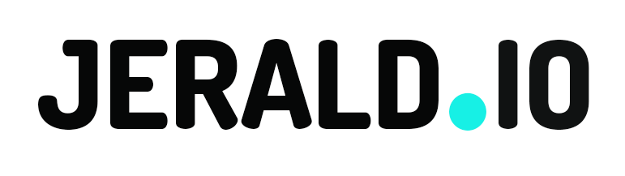

 

  

<h2 align="center">Hi, 👋  &nbsp; I am Jerald Baroro</h2>
## ⚡ Technologies

 

  

 

<!---
jerald-devOfficial/jerald-devOfficial is a ✨ special ✨ repository because its `README.md` (this file) appears on your GitHub profile.
You can click the Preview link to take a look at your changes.
--->

